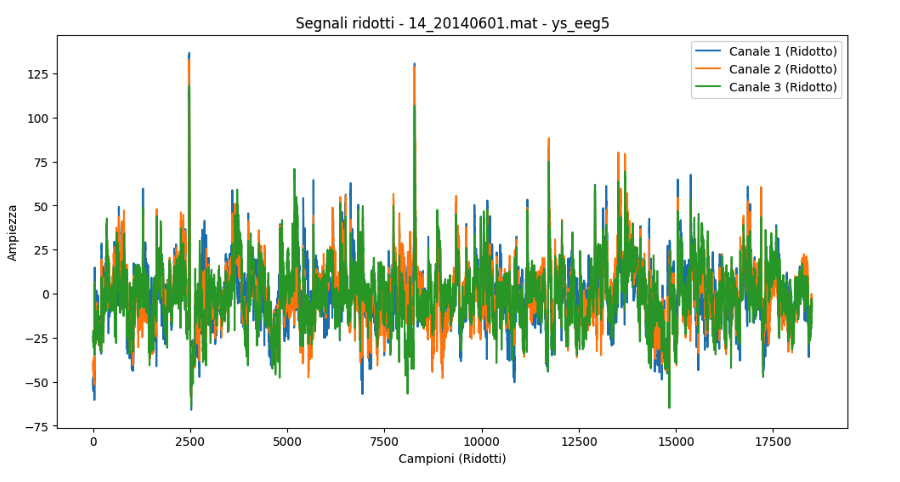
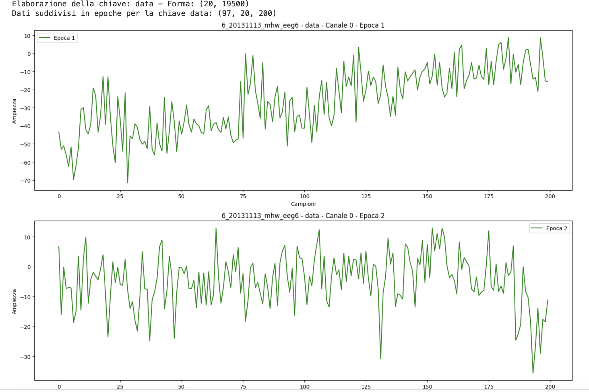
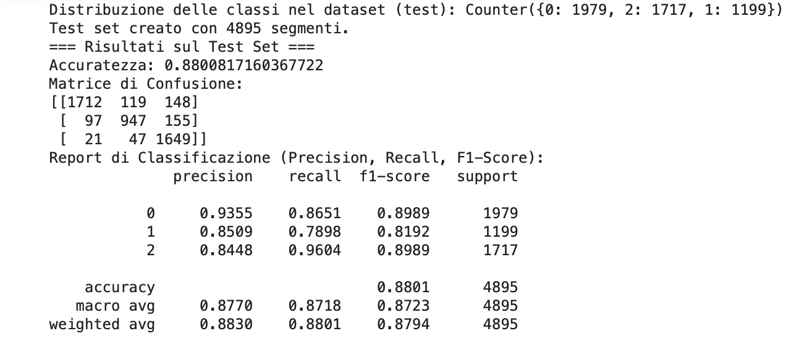

# **Contrastive Representation Learning for Electroencephalogram Classification**  
**Author:** Pasquale Ricciulli (2115446)  

This repository provides a simplified reimplementation of the paper:  
[Contrastive Representation Learning for Electroencephalogram Classification](https://proceedings.mlr.press/v136/mohsenvand20a.html).

The goal is to leverage self-supervised contrastive learning techniques to enhance the representation quality of EEG signals and improve the accuracy of emotion classification. By learning robust feature embeddings that differentiate between similar and dissimilar signal segments, the model can more effectively classify EEG data into emotional states (negative, neutral, and positive).

---

## **Overview**

Classifying emotional states from EEG data is challenging due to the noisy, high-dimensional, and time-dependent nature of the signals. Traditional supervised methods often rely on large, well-labeled datasets and may struggle to generalize. Contrastive representation learning helps overcome these limitations by learning meaningful, low-dimensional embeddings without relying directly on labels.

In this approach:
1. **Preprocessing** ensures data quality by resampling, filtering, and removing artifacts.
2. **Data Augmentation** increases sample diversity and prevents overfitting.
3. **Contrastive Learning** trains encoders (recurrent and convolutional) to distinguish between positive and negative pairs of augmented EEG segments.
4. **Emotion Recognition** uses the learned representations to classify EEG signals into one of three emotional states.
5. **Evaluation** compares the performance of different encoders, highlighting the gains in accuracy and robustness.

---

## **Methodology**

### 1. Preprocessing EEG Data

EEG signals can contain various artifacts and noise sources. To ensure the model focuses on relevant brain activity, we apply a preprocessing pipeline that includes:

- **Resampling:** All EEG signals are resampled to 200 Hz, ensuring uniform segment sizes.
- **Band-pass Filtering:** A fifth-order Butterworth filter retains frequencies of interest while removing irrelevant frequency components.
- **Artifact Removal:** Channels exceeding 500 µV are discarded to remove extreme noise or non-physiological signals.

**Result:** The cleaned, uniform data is now ready for subsequent feature extraction and training steps.

#### Example of the raw EEG signal (Seed dataset):


#### Example of the preprocessed EEG signal (Seed dataset):


#### 1-second epochs (200 samples each) for classification tasks:


#### From original to preprocessed (Texas State University Resting State dataset):


---

### 2. Data Augmentation

To improve the model’s generalization and robustness, we apply a range of augmentations. Each original EEG chunk is transformed into multiple variations, exposing the model to diverse conditions. These techniques help the encoder learn invariant features that hold true across a spectrum of scenarios.

**Augmentation Techniques:**
- **Amplitude Scaling**
- **Time Shifts**
- **DC Shifts**
- **Zero Masking**
- **Additive Gaussian Noise**
- **Band-stop Filtering**

| Transformation                      | Min    | Max  |
|-------------------------------------|--------|------|
| Amplitude scale                     | 0.5    | 2    |
| Time shift (samples)                | -50    | 50   |
| DC shift (µV)                       | -10    | 10   |
| Zero-masking (samples)              | 0      | 150  |
| Additive Gaussian noise (σ)         | 0      | 0.2  |
| Band-stop filter (5 Hz width) (Hz)  | 2.8    | 82   |

#### Example of an augmented EEG signal:


---

### 3. Contrastive Learning

In contrastive learning, we create pairs of samples to teach the encoder a meaningful representation space:

- **Positive Pairs:** Two augmented views of the same EEG chunk. The encoder learns to maximize similarity between these two views.
- **Negative Pairs:** Pairs drawn from different EEG chunks or trials. The encoder learns to minimize similarity, pushing these pairs apart in the embedding space.

By optimizing a contrastive loss function, the encoder discovers low-dimensional representations that effectively separate distinct EEG patterns without relying on label information.

We experiment with two encoder architectures:

- **Recurrent Encoder (RNN-based):** Captures temporal dependencies, potentially excelling at sequential signal patterns.
- **Convolutional Encoder (CNN-based):** Efficiently extracts local features and is easily scalable.

#### Encoder Architectures:


---

### 4. Emotion Recognition Classifier

After the encoder is trained using contrastive learning, we **freeze** its weights. The fixed embeddings become input features for a supervised classifier that predicts the emotional state:

- **0 (Negative)**
- **1 (Neutral)**
- **2 (Positive)**

The classifier is trained using the labeled data and a standard cross-entropy loss. This two-stage process—unsupervised pretraining followed by supervised fine-tuning—yields a model that can classify EEG signals with improved accuracy and robustness.

---

### 5. Evaluation

We evaluate the trained models on a held-out test set. Key metrics include:

- **Accuracy**
- **Precision**
- **Recall**
- **F1-score**
- **Confusion Matrix**

These metrics provide insight into the model’s performance, highlighting strengths and potential areas for improvement. We compare results from the recurrent and convolutional encoders to understand which architecture better captures EEG signal characteristics under this contrastive framework.

---

## **Results**

### Recurrent model
- **Accuracy:** ~88%

**Confusion Matrix and Classification Report:**



The recurrent encoder captures temporal dependencies effectively, resulting in high accuracy and strong overall performance in classifying emotional states.

---

### Convolutional model
- **Accuracy:** ~85%

**Confusion Matrix and Classification Report:**


---

## **Key Takeaways**

- **Recurrent Encoder:** Achieves top accuracy (88%), indicating that modeling temporal dependencies is vital for effective EEG classification.
- **Convolutional Encoder:** Highly efficient and competitive a little bit less accurate then Recurrent.

This project demonstrates that contrastive learning can significantly improve the quality of EEG signal representations, making subsequent classification more accurate and robust.

---

## **References**

- Mohsenvand, M., et al. *"Contrastive Representation Learning for Electroencephalogram Classification."* ML4H at NeurIPS (2020).  
  [Link](https://proceedings.mlr.press/v136/mohsenvand20a.html)

---

## **How to Use**
You can use the the provided Jupyter notebooks.
The Training_encoders file is used to train the encoders, if you want the weights, please contact me.
The Training_classifier file contains the code for training and the code for evaluation
1. **Clone the Repository:**
   ```bash
   git clone https://github.com/your-repository-name.git
   ```
2. Start loading the notebook in a Jupyter environment.
3. Load the dataset, and run all cells for both files.
4. The last cell contains the evaluation of the two classifiers.
